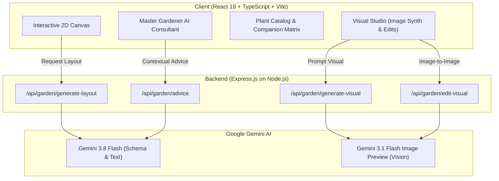

# 🌿 Verdant: Dream Garden Designer

<div align="center">


**An intelligent, AI-powered landscape design and botanical planning platform built with React 19, TypeScript, Tailwind CSS, Express, and Google Gemini 3.8.**

[](https://react.dev/)
[](https://www.typescriptlang.org/)
[](https://vitejs.dev/)
[](https://tailwindcss.com/)
[](https://ai.google.dev/)
[](https://expressjs.com/)

[Key Features](#-key-features) • [Tech Stack](#-tech-stack) • [Quick Start](#-quick-start) • [Architecture](#-architecture) • [Project Structure](#-project-structure) • [License](#-license)

</div>

---

## 📖 Overview

**Verdant: Dream Garden Designer** is an end-to-end landscape architecture and ecological garden planner. Whether designing a compact suburban kitchen potager, an aromatic Mediterranean courtyard, or a contemplative Japanese Zen sanctuary, Verdant merges ecological science with state-of-the-art generative AI to plan, visualize, and nurture your green sanctuary.

---

## ✨ Key Features

### 📐 1. Interactive 2D Blueprint Canvas
- Real-time 2D grid planner scaled to your exact yard dimensions (width, length, square footage).
- Functional microclimate zoning: kitchen potagers, herb spirals, pollinator ribbons, dining arbors, and shade sanctuaries.
- Visual hardscaping placement: flagstone pathways, cedar planter boxes, water fountains, and pergolas.
- Interactive Zone Inspector detailing sun exposure, soil requirements, and compatible plant selections.

### 🧠 2. Intelligent AI Layout Generator
- Powered by **Gemini 3.8 Flash** with structured schema outputs.
- Customizes layouts based on lot dimensions, soil drainage, sunlight hours, USDA hardiness zones, pet safety, and maintenance goals.
- Auto-generates balanced botanical selections, companion planting relationships, and four-season care calendars.

### 🎨 3. Photorealistic Visual Studio
- High-fidelity landscape visual synthesis using **Gemini Image Preview**.
- **Conversational Image-to-Image Editing**: Modify renders in natural language (e.g., *"Add a limestone pathway with lavender borders"* or *"Show this at sunset with warm lanterns"*).
- Multi-aspect ratio support (`16:9`, `1:1`, `4:3`) with revision history and before/after comparisons.

### 🌸 4. Curated Botanical Palette & Companion Matrix
- Comprehensive plant catalog covering perennials, shrubs, trees, edibles, herbs, climbers, and groundcovers.
- **Companion Planting Mutualism Matrix**: Detects beneficial synergies (pest deterrence, nutrient cycling, pollinator draw) and flags antagonistic pairings.
- On-demand AI portrait synthesis for individual species.
- Four-season maintenance guide (Spring waking, Summer peak, Autumn harvest, Winter protection).

### 🧑‍🌾 5. Master Gardener AI Consultant
- Real-time conversational horticulturist and permaculture expert.
- Context-aware: Grounded in your active garden's layout, microclimates, and plant species.
- Delivers actionable advice on soil biology, pest control, pruning schedules, and organic fertilization.

### 📄 6. Blueprint Specification Export
- Download comprehensive plain-text design specifications containing executive summaries, zone coordinate matrices, plant manifests, and seasonal schedules with a single click.

---

## 🛠 Tech Stack

| Layer | Technology |
|---|---|
| **Frontend** | React 19, TypeScript, Vite 8, Motion (Framer Motion), Lucide React |
| **Styling** | Tailwind CSS v4 |
| **Backend** | Express 4, Node.js (via `tsx`) |
| **AI SDK** | Google Gen AI SDK (`@google/genai`) |
| **AI Models** | `gemini-3.8-flash` (Structured Planning & Advice)<br>`gemini-3.1-flash-image-preview` (Visual Synthesis & Edits) |

---

## 🏗 Architecture



---

## 🚀 Quick Start

### Prerequisites
- [Node.js](https://nodejs.org/) (version 18 or higher recommended)
- A [Google Gemini API Key](https://aistudio.google.com/app/apikey)

### 1. Clone the Repository
```bash
git clone https://github.com/abidali72/Dream-Garden-Designer.git
cd Dream-Garden-Designer
```

### 2. Install Dependencies
```bash
npm install
```

### 3. Configure Environment Variables
Create a `.env` or `.env.local` file in the project root:
```env
# Required: Your Gemini API Key from Google AI Studio
GEMINI_API_KEY=your_actual_gemini_api_key_here

# Optional: Server Port (defaults to 3000)
PORT=3000
```

### 4. Run the Development Server
```bash
npm run dev
```

Open your browser and navigate to:
```
http://localhost:3000
```

---

## 📁 Project Structure

```
Dream-Garden-Designer/
├── src/
│   ├── assets/
│   │   └── images/              # Preset high-res garden photographs
│   ├── components/
│   │   ├── Header.tsx           # Global navigation & preset picker
│   │   ├── InteractiveCanvas.tsx# 2D garden grid & microclimate zone inspector
│   │   ├── LayoutGeneratorModal.tsx # AI layout prompt & parameter form
│   │   ├── MasterGardener.tsx   # Conversational horticulturist chat
│   │   ├── PlantCatalog.tsx     # Botanical directory & companion matrix
│   │   ├── PlantDetailModal.tsx # Plant inspection & portrait generator
│   │   └── VisualStudio.tsx     # Generative image synthesis & editing
│   ├── data/
│   │   └── gardenPresets.ts     # Curated starter gardens
│   ├── types/
│   │   └── garden.ts            # Type definitions for zones, plants, designs
│   ├── App.tsx                  # Main state container & tab routing
│   ├── index.css                # Global Tailwind CSS styles
│   └── main.tsx                 # React DOM entry point
├── server.ts                    # Express server & Gemini API endpoints
├── metadata.json                # Project metadata
├── package.json                 # Dependencies and scripts
├── tsconfig.json                # TypeScript configuration
├── vite.config.ts               # Vite configuration
└── README.md                    # Project documentation
```

---

## 📜 Available Scripts

| Script | Command | Description |
|---|---|---|
| **Development** | `npm run dev` | Runs the Express server with Vite middleware in live-reload mode |
| **Build** | `npm run build` | Compiles the production bundle with Vite |
| **Start** | `npm run start` | Starts the production Express server |
| **Type Check** | `npm run lint` | Runs `tsc --noEmit` to validate TypeScript types |
| **Clean** | `npm run clean` | Removes `dist` and generated artifacts |

---

## 🤝 Contributing

Contributions, issues, and feature requests are welcome!
1. Fork the Project
2. Create your Feature Branch (`git checkout -b feature/AmazingFeature`)
3. Commit your Changes (`git commit -m 'Add some AmazingFeature'`)
4. Push to the Branch (`git push origin feature/AmazingFeature`)
5. Open a Pull Request

---

## 📄 License

This project is licensed under the MIT License - see the [LICENSE](LICENSE) file for details.
